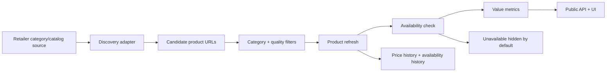

# StackScout Retailer Dashboard

Last cache refresh: `2026-06-05T04:38:35.556Z`  
Last cache discovery refresh: `2026-06-05T04:37:59.387Z`  
Public API source: Supabase
Refresh cadence: daily while the server is running

## Status Key

- ✅ Strong: automated discovery or live refresh is working.
- 🟡 Partial: useful data exists, but coverage or confidence is limited.
- ⚠️ Weak: manual, stale, blocked, or one-product coverage.
- Hidden products are kept in the database/cache but are not shown publicly by default.

## Current Snapshot

| Metric | Current value |
|---|---:|
| Retailers with at least one displayed product | 13 |
| Total tracked products in cache | 123 |
| Displayed available products in cache | 99 |
| Hidden unavailable products | 24 |
| Retailers with automated discovery configured | 12 |
| Retailers with seed/manual coverage only | 1 |
| Categories with real data | Creatine, whey/isolate protein, pre-workout |
| Target MVP categories | Creatine, whey/isolate protein, pre-workout |

## Category Snapshot

| Category | Tracked | Displayed | Hidden | Current confidence |
|---|---:|---:|---:|---|
| Creatine | 75 | 52 | 23 | ✅ Strongest coverage and most tested filters |
| Whey/isolate protein | 30 | 29 | 1 | 🟡 Live data exists, but retailer coverage is still partial |
| Pre-workout | 18 | 18 | 0 | 🟡 Live data exists, but fewer retailers pass v1 discovery |

## Coverage Flow

## Retailer Status

| Retailer | Status | Categories now covered | Scraper / source | Runs daily | Coverage confidence | Notes |
|---|---|---|---|---|---|---|
| Sportsfuel | ✅ | Creatine, protein | `shopifyCollection`, `shopifySearchSuggest` | Yes | High for creatine, medium for protein | Pre-workout search is configured but did not yield valid v1 rows after filters/rate limits. |
| Supplements.co.nz | ✅ | Creatine, protein, pre-workout | `shopifyCollection`, `shopifySearchSuggest` | Yes | High for creatine, medium for new categories | Best current structured multi-category source. |
| Sprint Fit | ✅ | Creatine | `genericHtml` | Yes | Medium | HTML category discovery works for creatine; protein/pre-workout pages need parser work. |
| Xplosiv Supplements | 🟡 | Creatine, protein | `genericHtml` | Yes | Medium | Useful coverage, but product pages can rate-limit and several creatine products are unavailable. |
| NZ Muscle | ✅ | Creatine, protein | `shopifySearchSuggest` | Yes | Medium | Stronger after product JSON enrichment; pre-workout did not pass v1 parsing yet. |
| Musashi NZ | 🟡 | Creatine, protein, pre-workout | `shopifySearchSuggest` | Yes | Medium | Small but clean product range after filters. |
| Chemist Warehouse | ✅ | Creatine | `chemistWarehouseSearch` | Yes | Medium | Creatine API works; protein/pre-workout search returned HTTP 500 in this pass. |
| Net Pharmacy | ✅ | Creatine | `shopifySearchSuggest` | Yes | Medium | Stronger creatine coverage; protein/pre-workout did not yield valid rows. |
| HealthPost | 🟡 | Creatine, protein, pre-workout | `shopifySearchSuggest` | Yes | Medium | Search discovery works, but coverage is limited by strict category filters. |
| NZ Protein | 🟡 | Creatine, protein, pre-workout | `genericHtml` | Yes | Medium | Product grid discovery now finds clean MVP-category products, but the range is small. |
| Bargain Chemist | 🟡 | Creatine, protein, pre-workout | `shopifySearchSuggest` | Yes | Medium | New categories work better than creatine for this retailer. |
| BN Healthy | 🟡 | Creatine | `shopifySearchSuggest` | Yes | Low / medium | Search discovery is configured, but the range appears small after filters. |
| iHerb NZ | ⚠️ | Creatine | `manualFallback` | No reliable live fetch | Low / blocked | Server-side fetch is blocked, so this uses saved stale data until a feed/API exists. |

## What We Can Trust Today

- ✅ The app has enough creatine data to compare a real set of NZ-accessible products.
- ✅ Protein and pre-workout now have real product rows, prices, links, and availability.
- ✅ Sportsfuel and Supplements.co.nz have the strongest structured discovery.
- ✅ Sprint Fit and Xplosiv add useful coverage through HTML discovery.
- ✅ Daily refresh updates product status, current price data, and availability where fetches work.
- 🟡 Retailer coverage is not complete because many shops still have only one seeded product.
- 🟡 Current trust is strongest for creatine; protein and pre-workout are useful but still need wider retailer coverage.
- ⚠️ iHerb is not live; it should be labelled as a manual/stale fallback until a clean data source exists.

## MVP Coverage Target

MVP retailer coverage should mean more than "we have one product from the shop."

Target for launch:

- At least 6-8 important NZ-accessible retailers with automated discovery.
- Each target retailer should support all MVP categories where possible:
  - creatine
  - whey/isolate protein
  - pre-workout
- Each retailer/category should have a coverage confidence:
  - High: structured feed, Shopify collection, full catalog, or complete paginated category.
  - Medium: category HTML or search page discovery.
  - Low: one seeded product, manual fallback, or incomplete discovery.
  - Blocked: retailer blocks server-side fetching and no approved feed exists.

## Next Coverage Work

1. Run the Supabase schema update so `category` becomes a real SQL column, not only metadata fallback.
2. Improve pre-workout coverage for Sportsfuel, NZ Muscle, Xplosiv, and Sprint Fit.
3. Fix Chemist Warehouse protein/pre-workout API discovery or use another approved source.
4. Add coverage confidence to `/api/status` so this dashboard can become live later.
5. Refine trust labels with coverage confidence once adapter confidence is exposed through `/api/status`.

## Important Caveat

StackScout should avoid claiming it has every product from every retailer. The safer and more trustworthy claim is:

> StackScout discovers products from visible retailer category, catalog, and product sources, checks them daily where possible, and clearly labels data confidence.
