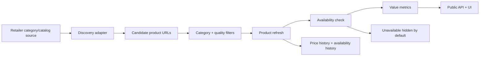

# StackScout Retailer Dashboard

Last cache refresh: `2026-06-16T04:00:55.803Z`
Last cache discovery refresh: `2026-06-16T03:59:08.698Z`
Public API source: Supabase
Refresh cadence: daily while the server is running

## Status Key

- ✅ Strong: automated discovery or live refresh is working.
- 🟡 Partial: useful data exists, but coverage or confidence is limited.
- ⚠️ Weak: manual, stale, blocked, or one-product coverage.
- Hidden products are kept in the database/cache but are not shown publicly by default.

## Current Snapshot

| Metric | Current value |
|---|---:|
| Retailers with at least one displayed product | 13 |
| Total tracked products in cache | 297 |
| Displayed available products in cache | 262 |
| Hidden unavailable products | 35 |
| Retailers with automated discovery configured | 12 |
| Retailers with seed/manual coverage only | 1 |
| Categories with real data | Creatine, whey protein, protein isolate, plant protein, mass gainer, protein bars, pre-workout, non-stim pre-workout, electrolytes |
| Target MVP categories | Same as real data; coverage depth still varies by retailer |

## Category Snapshot

| Category | Tracked | Displayed | Hidden | Current confidence |
|---|---:|---:|---:|---|
| Creatine | 78 | 53 | 25 | ✅ Strongest historical coverage and most tested filters |
| Whey protein | 35 | 33 | 2 | ✅ Good structured coverage; excludes isolate and plant protein |
| Protein isolate | 24 | 22 | 2 | 🟡 Useful coverage; strict filters avoid regular whey pollution |
| Plant-based protein | 21 | 19 | 2 | 🟡 Useful coverage; strict filters avoid whey/isolate pollution |
| Mass gainer | 7 | 7 | 0 | 🟡 Smaller category, but clean current matches |
| Protein bars | 51 | 50 | 1 | 🟡 Broad coverage; box-size parsing is improved but still worth spot-checking |
| Pre-workout | 32 | 32 | 0 | 🟡 Stimulant pre-workout only; non-stim split out |
| Non-stim pre-workout | 9 | 9 | 0 | 🟡 Smaller category, separated from regular pre-workout |
| Electrolytes | 40 | 37 | 3 | 🟡 Useful coverage; includes hydration/electrolyte products with parseable size |

## Coverage Flow

## Retailer Status

| Retailer | Status | Categories now covered | Scraper / source | Runs daily | Coverage confidence | Notes |
|---|---|---|---|---|---|---|
| Sportsfuel | ✅ | Creatine, whey, isolate, mass gainer, electrolytes | `shopifyCollection`, `shopifySearchSuggest` | Yes | High for creatine, medium for expanded categories | Structured source works, but many old unavailable rows remain hidden. |
| Supplements.co.nz | ✅ | Creatine, whey, isolate, plant, mass gainer, bars, pre-workout, non-stim | `shopifyCollection`, `shopifySearchSuggest` | Yes | High for creatine, medium for expanded categories | Strong structured multi-category source. |
| Sprint Fit | ✅ | Creatine | `genericHtml` | Yes | Medium | HTML category discovery still produces mostly creatine after strict filters. |
| Xplosiv Supplements | 🟡 | Creatine, whey, isolate, plant, mass gainer, electrolytes | `genericHtml` | Yes | Medium | Useful coverage, but some product pages rate-limit and several rows are unavailable. |
| NZ Muscle | ✅ | Creatine, whey, isolate, plant, mass gainer, bars, electrolytes | `shopifySearchSuggest` | Yes | Medium | Strong expanded-category source after product JSON enrichment. |
| Musashi NZ | 🟡 | Whey, isolate, bars, pre-workout, non-stim, electrolytes | `shopifySearchSuggest` | Yes | Medium | Small but clean product range after filters. |
| Chemist Warehouse | ✅ | Creatine, plant, bars, pre-workout, non-stim, electrolytes | `chemistWarehouseSearch` | Yes | Medium | Search API now contributes broad expanded coverage. |
| Net Pharmacy | ✅ | Creatine, whey, electrolytes | `shopifySearchSuggest` | Yes | Medium | Clean but category-limited coverage. |
| HealthPost | 🟡 | Creatine, whey, isolate, plant, bars, pre-workout, non-stim, electrolytes | `shopifySearchSuggest` | Yes | Medium | Useful category spread; several rows are stale after fetch. |
| NZ Protein | 🟡 | Creatine, whey, isolate, plant, mass gainer, protein bars, pre-workout, electrolytes | `genericHtml` | Yes | Medium | Product grid discovery finds clean matches, but range is small. |
| Bargain Chemist | 🟡 | Isolate, plant, bars, pre-workout, non-stim, electrolytes | `shopifySearchSuggest` | Yes | Medium | New categories work better than creatine for this retailer. |
| BN Healthy | ⚠️ | None displayed | `shopifySearchSuggest` | Yes | Low | Configured, but no displayed products pass filters. |
| iHerb NZ | ⚠️ | Creatine | `manualFallback` | No reliable live fetch | Low / blocked | Server-side fetch is blocked, so this uses saved stale data until a feed/API exists. |

## What We Can Trust Today

- ✅ The app has enough creatine data to compare a real set of NZ-accessible products.
- ✅ Expanded protein, pre-workout, and electrolyte categories now have real product rows, prices, links, and availability.
- ✅ Protein bars and non-stim pre-workout are split from powder protein and regular pre-workout.
- ✅ Sportsfuel, Supplements.co.nz, NZ Muscle, Chemist Warehouse, and HealthPost provide the strongest expanded-category coverage.
- ✅ Sprint Fit, Xplosiv, and NZ Protein add useful HTML-discovery coverage.
- ✅ Daily refresh updates product status, current price data, and availability where fetches work.
- 🟡 Retailer coverage is not complete; BN Healthy has no displayed products and iHerb remains manual/stale.
- 🟡 Value ranking is still price per 100g, which is less ideal for bars, electrolytes, and category-specific protein comparisons.
- ⚠️ iHerb is not live; it should be labelled as a manual/stale fallback until a clean data source exists.

## MVP Coverage Target

MVP retailer coverage should mean more than "we have one product from the shop."

Target for launch:

- At least 6-8 important NZ-accessible retailers with automated discovery.
- Each target retailer should support the expanded categories where possible:
  - creatine
  - whey protein
  - protein isolate
  - plant-based protein
  - mass gainer
  - protein bars
  - pre-workout
  - non-stim pre-workout
  - electrolytes
- Each retailer/category should have a coverage confidence:
  - High: structured feed, Shopify collection, full catalog, or complete paginated category.
  - Medium: category HTML or search page discovery.
  - Low: one seeded product, manual fallback, or incomplete discovery.
  - Blocked: retailer blocks server-side fetching and no approved feed exists.

## Next Coverage Work

1. Run the Supabase schema update so `category` becomes a real SQL column, not only metadata fallback.
2. Watch cron runtime after the expanded discovery matrix; category batching may be needed.
3. Improve low/no coverage retailers, especially BN Healthy and iHerb.
4. Add coverage confidence to `/api/status` so this dashboard can become live later.
5. Refine trust labels with coverage confidence once adapter confidence is exposed through `/api/status`.

## Important Caveat

StackScout should avoid claiming it has every product from every retailer. The safer and more trustworthy claim is:

> StackScout discovers products from visible retailer category, catalog, and product sources, checks them daily where possible, and clearly labels data confidence.
